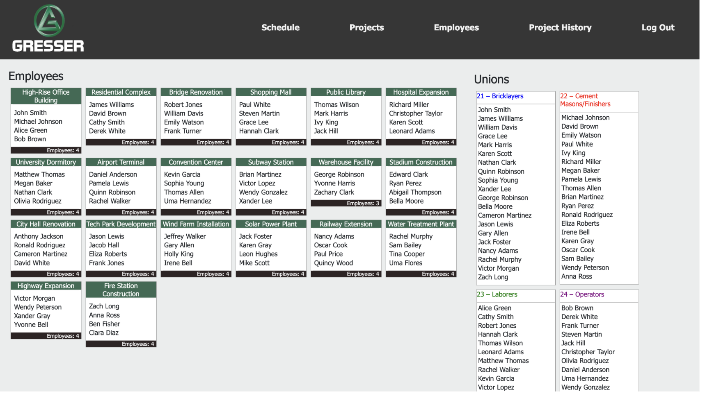

Description
Duration: 2 Week Sprint

The Gresser Scheduling app is designed to store employees, projects and relevant history.   

The application utilizes React and Redux on the front end. The backend is supported by Node.js, Express and Postgres.  

The application is designed to carry forward functionalities present in the hedgehog software but with a database to store and retrieve information. 

Installation 

1. Create a PostgreSQL database named `gresser_app`.
2. Use the queries in the `database.sql` file to create all necessary tables and populate the needed data for the application. We recommend using Postico to run these queries, as it was used during the creation of the queries.
3. Open your terminal and navigate to the project directory.
4. Run `npm install` to install all project dependencies.
5. Run `npm install bootstrap`.
6. Run `npm install jquery popper.js`.
7. Run `npm install react-dnd react-dnd-html5-backend`.
8. Open your editor of choice and ensure all dependencies are installed by running `npm install`.
9. Run `npm run server` in your terminal to start the server.
10. In a new terminal tab, run `npm run client` to start the client.
11. The `npm run client` command will automatically open a new browser tab for you with the application running.

Login
Once the application is loaded on the browser, you’ll be redirected to the login page. If you do not have user credentials, click the register link and follow the form. Once logged in, you’ll be redirected to the scheduling page. 

Projects 
As an administrator, I want to add Projects for the purpose of scheduling.   

Select “Projects” in the Navigation bar. 
Enter the project number, name, location, start date and end dates in the input fields.
Click the Submit button 
The new job will be displayed in the table 

Change Project Status
As an administrator, I want to change the project status from inactive to active. 
In the Status column click on the Inactive button to change it to Active
Click on the Edit button to edit the project selected

Delete Project
As an administrator, I want to delete a project. 
Click on the delete button to delete the project selected 

Employee 
As an administrator, I want to add an employee. 
Select “Employees” in the navigation bar
Enter Last Name, First Name, Employee Number, select a union, enter phone number, email, and address.
Click on the Add Employee button
The new employee will be displayed in the table 

Change Employee Status 
As an administrator, I want to change employee status from inactive to active.  
1. In the Status column click on the Inactive button to change it to Active

Scheduling Page

As an administrator, I want to view employees and projects so that I can manage scheduling effectively.
All available jobs and employees are shown when navigating to /scheduling.   
If there are no projects a message is displayed indicating no projects are available. 

Move Employee to Project

As an administrator, I want to assign an employee to a project. 
1.Click on the employee you want to move.
2. Drag the employee to the project you want to assign them to.
3.The employee is now assigned to the job. 

Reassign Employee to Project

As an administrator, I want to reassign an employee to a project. 
Click on the employee you want to move.
Drag the employee to the project you want to assign them to.
The employee is now assigned to the job. 

View Employee Count for a Project

As an administrator, I want to view the employee count for a project. 
Navigate to /schedule
The number of employees currently assigned to each project is automatically displayed. 

Project History Page

As an administrator, I want to filter job history by date, so that I can view job details for a specific day.

Steps
1. Open the Job History page.
2. Select a date from the date picker.
3. The job history table updates to show jobs from the selected date.

Generate a Job History Report

As an administrator, I want to generate a report of the job history, so that I can view summarized data of all jobs.

1. Open the Job History page.
2. Click the "Generate Report" button.
3. The report is displayed below the job history table.

Mark a Job as a Rain Day

As an administrator, I want to mark a job as a rain day, so that I can keep track of weather-related delays.

1. Open the Job History page.
2. Select a date from the date picker.
3. Check the checkbox next to the job to mark it as a rain day.
4. The job history table updates to show the change.

Built With
Node.js, Express, React, Redux, Axios, Popper.js, PostgreSQL, React Dnd

